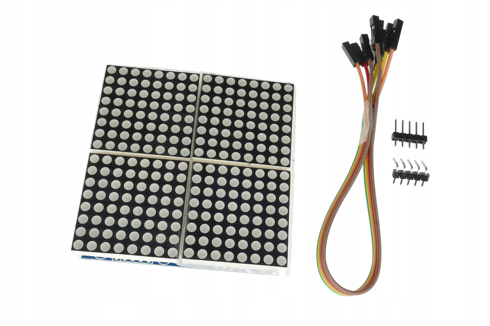
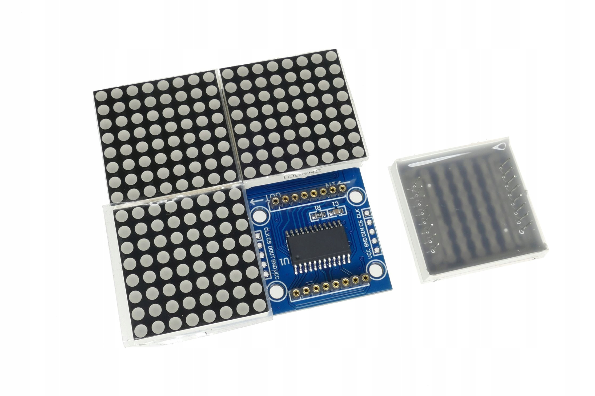
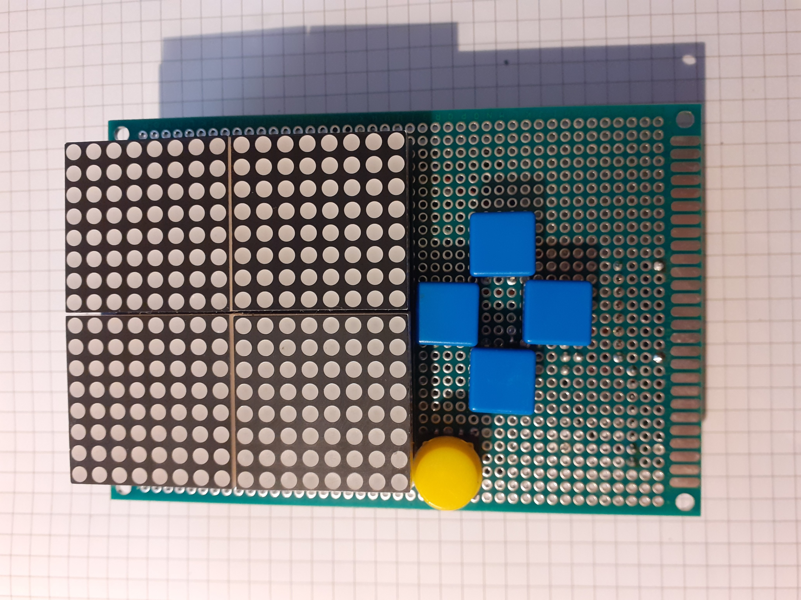
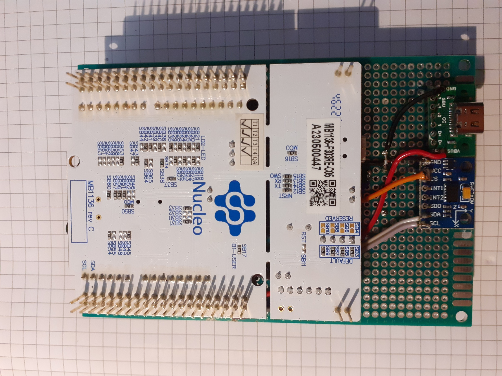
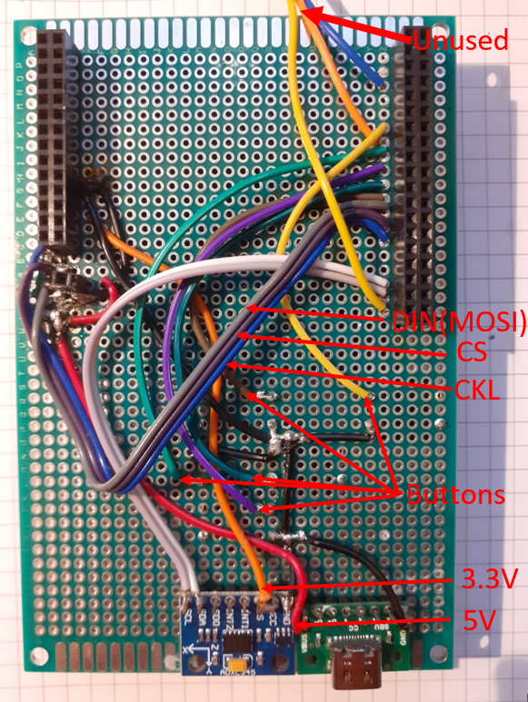

# Stm32Games

## Purpose of project

Make simple and cheap handheld console powered by stm32. Can be usefull for learning microcontroler programing. Used in project:

- SPI

- I2C

- timers

- external interupts

- bitwise operations

## Implemented games

WARNING games may have bugs or not be faithfull to the original versions(snake, tetris).

### Snake

### Tetris

### Space

You have to avoid different speed and shape asteroids moving towards you.
TODO: sometimes obstacles spawn in a way making them impossible to avoid.

## Menus

- INPUT - input used in games accelerometer(tilting) or buttons

- LEVEL - difficulty of games

- SCREEN - screen brightness

## Used components

- NUCLEO-F303RE 
https://os.mbed.com/platforms/ST-Nucleo-F303RE/
https://www.st.com/resource/en/user_manual/um1724-stm32-nucleo64-boards-mb1136-stmicroelectronics.pdf

- LED DISPLAY MODULE 16X16 MAX7219 CONTROLLER
https://www.analog.com/media/en/technical-documentation/data-sheets/max7219-max7221.pdf

- ADXL345 Accelerometer
https://www.analog.com/media/en/technical-documentation/data-sheets/adxl345.pdf

- USB 2.0 Type-C Connector Breakout Board
https://www.pololu.com/product/3411

- Universal double sided board 80x120mm

- Tact Switch 10x10mm with cap - square blue - 5pcs

- Goldpin strip 2x40 female 2.54mm pitch - 2pcs.

## Powering board

When playing I power board via E5V pin, power is taken from usb-c breakout board. 
To do that jumper(JP5) is connecting E5V with PWR. 

When programing board with jumper in that position it is nescesarry to connect both usb cables.

## Mounting components together

- CS pin of ADXL345 is connected to 3.3V

## Used programs

- STM32CubeMX

- STM32CubeIDE